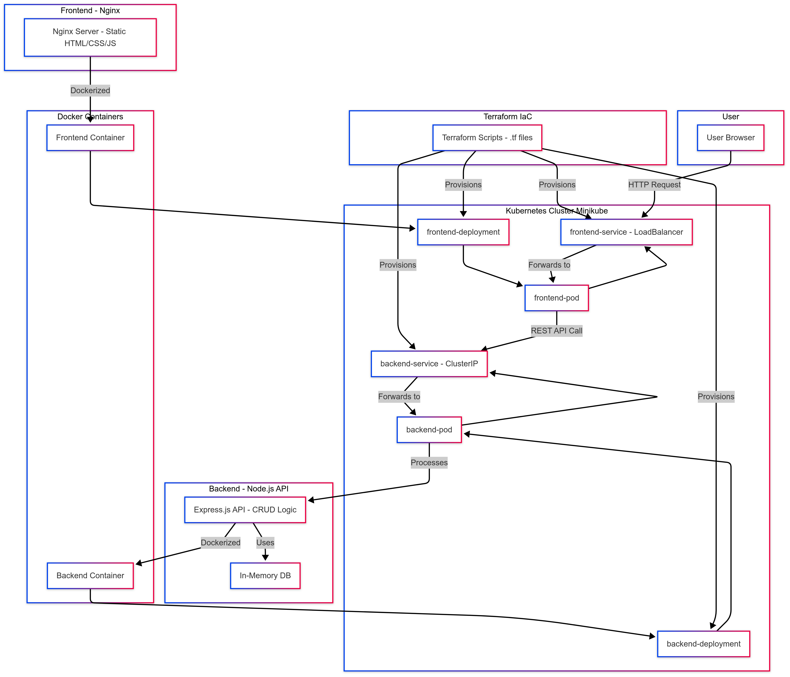

# Mini Project: Infrastructure as Code (IaC) with Terraform & Kubernetes

## Overview

This project automates the deployment of a full-stack application using:

- **Terraform** for provisioning Kubernetes resources.
- **Docker** for containerizing frontend (Nginx) and backend (Node.js) components.
- **Kubernetes** for orchestration.

## Setup

1. Clone the repository:
   ```bash
   git clone https://github.com/Gowtham0509/IaC-Terraform-Kubernetes.git
   ```
2. Deploy:
   ```bash
   cd terraform
   terraform init
   terraform apply
   ```

## Architecture



## Contributors

- Gowtham A(https://github.com/Gowtham0509)
